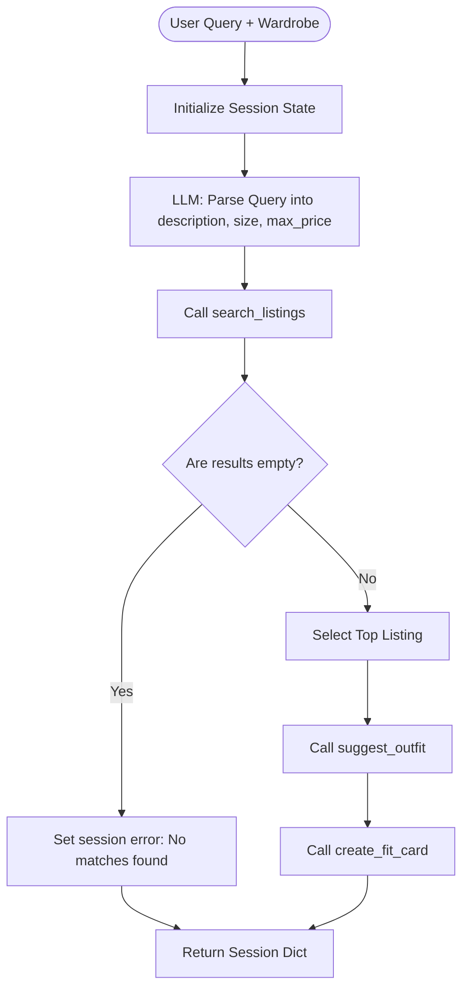

# FitFindr — planning.md

---

## Tools

List every tool your agent will use. For each tool, fill in all four fields.
You must have at least 3 tools. The three required tools are listed — add any additional tools below them.

### Tool 1: search_listings

**What it does:**
Searches the local database of secondhand clothing listings for items that match a description query, filtering optionally by size and maximum price. It scores matches by keyword overlap and returns them sorted from most to least relevant.

**Input parameters:**
- `description` (str): Search term keywords representing the item (e.g., "vintage graphic tee").
- `size` (str | None): Optional size filter. Case-insensitive substring match is used.
- `max_price` (float | None): Optional maximum price threshold (inclusive).

**What it returns:**
A list of matching listing dictionaries, where each dictionary represents a clothing listing with fields like `id`, `title`, `description`, `price`, `size`, `platform`, `colors`, etc., sorted by relevance score.

**What happens if it fails or returns nothing:**
If no listings match the search criteria, it returns an empty list `[]`. The planning loop will check this result and, finding it empty, terminate early with a user-friendly error message indicating no matching items were found.

---

### Tool 2: suggest_outfit

**What it does:**
Generates 1–2 creative outfit suggestions pairing a thrifted item with pieces from the user's existing wardrobe using an LLM.

**Input parameters:**
- `new_item` (dict): The listing dictionary for the newly found thrifted piece.
- `wardrobe` (dict): The user's wardrobe dictionary containing a list of items under the key `'items'`.

**What it returns:**
A markdown-formatted string containing styling recommendations. If the wardrobe is empty, it returns general styling ideas, styling tips, and suitable vibes for the new item.

**What happens if it fails or returns nothing:**
If the wardrobe is empty, the tool falls back to offering general styling ideas based purely on the new item's details. If the LLM service is unavailable, it returns a generic, friendly fallback styling suggestion.

---

### Tool 3: create_fit_card

**What it does:**
Uses an LLM to generate a short, catchy, and authentic social media caption (e.g., for Instagram or TikTok) celebrating the thrifted find and outfit recommendation.

**Input parameters:**
- `outfit` (str): The outfit suggestion string generated by Tool 2.
- `new_item` (dict): The listing dictionary of the thrifted piece.

**What it returns:**
A 2–4 sentence social media caption styled as a casual "OOTD" post. It naturally mentions the item title, price, and platform exactly once, avoiding corporate sales copy.

**What happens if it fails or returns nothing:**
If `outfit` is empty or missing, it returns a descriptive error message string instead of crashing. If the LLM call fails, it returns a standard fallback caption containing the item details.

---

### Additional Tools (if any)

*(None needed, the core 3 tools cover the required features)*

---

## Planning Loop

**How does your agent decide which tool to call next?**
The planning loop is a linear sequence that orchestrates the three tools:
1. **Query Parsing:** First, it uses the Groq LLM to parse the raw natural language query into search parameters (`description`, `size`, and `max_price`).
2. **Search Executing:** It calls `search_listings` using these parsed parameters.
3. **Guard/Branching:** It checks if the search results are empty. If they are, it sets the session error to a clear message and stops execution early.
4. **Item Selection:** If results exist, it selects the top-scoring listing as the primary item.
5. **Outfit Generation:** It calls `suggest_outfit` using the selected item and the user's wardrobe.
6. **Caption Generation:** It calls `create_fit_card` using the outfit suggestion and selected item.
7. **Finalization:** It returns the completed session state dictionary.

---

## State Management

**How does information from one tool get passed to the next?**
All state is stored in a single `session` dictionary that is passed through the steps of the planning loop:
- `query` (str): The original user query.
- `parsed` (dict): The structured parameters extracted from the query.
- `search_results` (list): The list of matching listings returned by `search_listings`.
- `selected_item` (dict): The chosen top listing, which is passed into `suggest_outfit` and `create_fit_card`.
- `wardrobe` (dict): The user's wardrobe dict, which is passed into `suggest_outfit`.
- `outfit_suggestion` (str): The styling response from `suggest_outfit`, which is passed to `create_fit_card`.
- `fit_card` (str): The final social media caption from `create_fit_card`.
- `error` (str | None): Stores any error messages that stop the agent execution early.

---

## Error Handling

| Tool | Failure mode | Agent response |
|------|-------------|----------------|
| search_listings | No results match the query | Sets `session["error"] = "No matching items found for your search."` and returns the session immediately. |
| suggest_outfit | Wardrobe is empty | Calls the LLM with a fallback prompt to give general styling tips for the item instead of specific wardrobe pairings. |
| create_fit_card | Outfit input is missing or incomplete | Returns an error message string: `"Error: Cannot generate fit card due to missing outfit details."` |

---

## Architecture

---

## AI Tool Plan

**Milestone 3 — Individual tool implementations:**
- **Tool 1: `search_listings`**: Code it directly using standard Python list operations and keyword overlap logic. Verify with mock queries in Python to make sure it filters and ranks correctly.
- **Tool 2: `suggest_outfit`**: Use the Groq API. Provide clear prompts distinguishing between an empty wardrobe and a populated one. Verify by calling it with both empty and example wardrobes.
- **Tool 3: `create_fit_card`**: Use the Groq API with a system prompt outlining the social media caption persona and guidelines. Verify that the output has 2-4 sentences and contains price/platform/title.

**Milestone 4 — Planning loop and state management:**
- Code the `run_agent` planning loop in `agent.py`. Use Groq structured JSON parsing to extract search inputs.
- Test the integration against the happy path and no-results path using `pytest` and CLI execution.

---

## A Complete Interaction (Step by Step)

**Example user query:** "I'm looking for a vintage graphic tee under $30. I mostly wear baggy jeans and chunky sneakers. What's out there and how would I style it?"

**Step 1:**
The agent parses the query:
- `description`: "vintage graphic tee"
- `size`: null
- `max_price`: 30.0

It calls `search_listings(description="vintage graphic tee", size=None, max_price=30.0)`.
This returns a list of matching items, with `lst_006` ("Graphic Tee — 2003 Tour Bootleg Style" at $24.00) as the top match.

**Step 2:**
The agent selects the top item: `lst_006`.
It calls `suggest_outfit(new_item=lst_006, wardrobe=example_wardrobe)`.
The LLM matches `lst_006` with the user's "Baggy straight-leg jeans, dark wash" (`w_001`) and "Chunky white sneakers" (`w_007`).
It returns: "Pair this vintage-style bootleg graphic tee with your dark wash baggy straight-leg jeans for a relaxed, classic streetwear silhouette. Finish the look with your chunky white sneakers to complete the Y2K/streetwear vibe."

**Step 3:**
The agent calls `create_fit_card(outfit=..., new_item=lst_006)`.
The LLM generates: "Stepping out in this 2003 tour bootleg style graphic tee I found on Depop for only $24. Styling it relaxed with baggy dark wash denim and chunky white kicks. Classic streetwear vibe for the day. 🛹✨"

**Final output to user:**
The Gradio app displays:
- **Top listing found:** Graphic Tee — 2003 Tour Bootleg Style ($24.00, Depop)
- **Outfit idea:** Pair this vintage-style bootleg graphic tee with your dark wash baggy straight-leg jeans for a relaxed...
- **Your fit card:** Stepping out in this 2003 tour bootleg style graphic tee...
